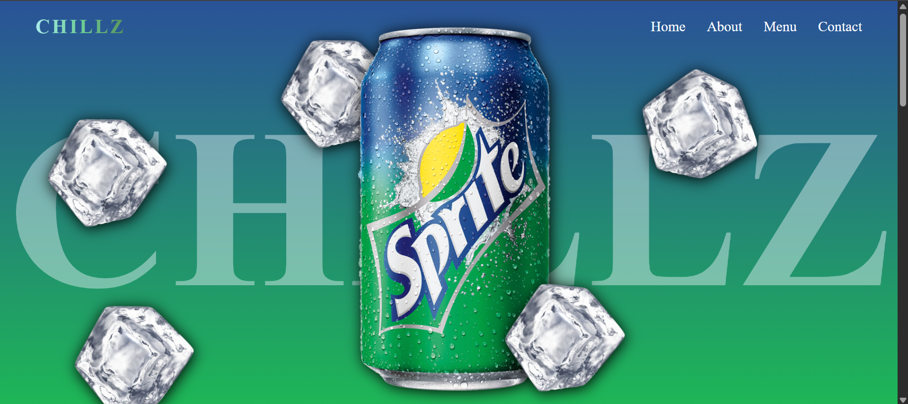
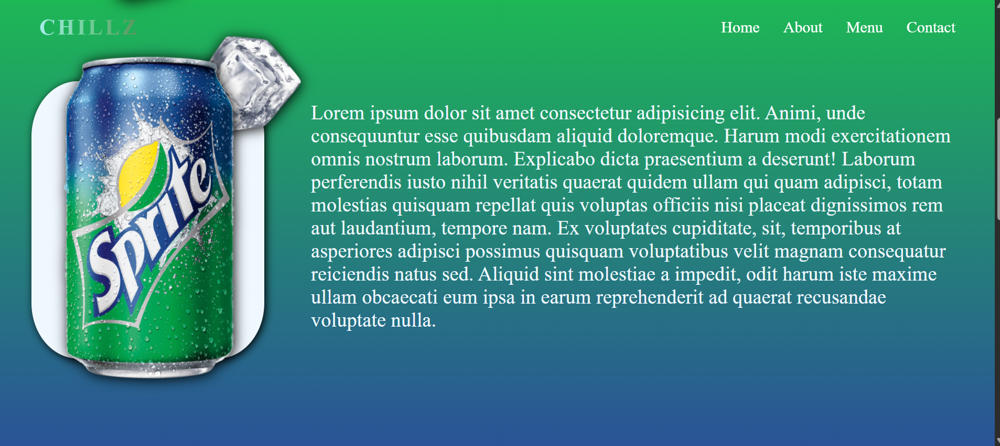
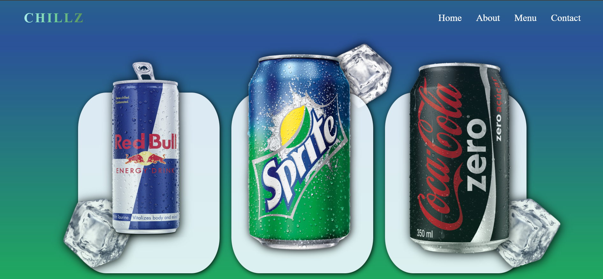
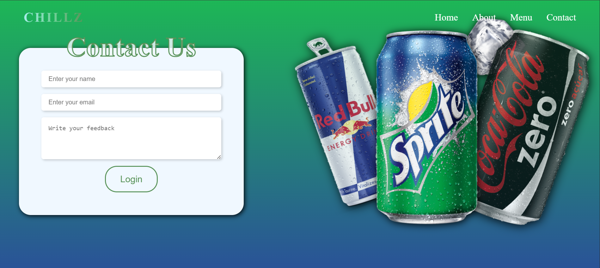

# 🌐 Scrolling Animated Website  

A visually engaging **Scrolling Animated Website** built using **HTML, CSS, JavaScript, GSAP, and ScrollTrigger**.  
This project demonstrates smooth scroll-based animations and interactive UI transitions, perfect for showcasing frontend creativity and animation skills.  

---

## 🚀 Features  
- ✨ Smooth scrolling with creative animations  
- 🎬 ScrollTrigger effects for section-based transitions  
- 🎨 Fully animated homepage, about, and project sections  
- ⚡ Fast, lightweight scrolling experience  
- 🧑‍💻 Beginner-friendly clean code structure  

---

## 🛠️ Tech Stack  
- **HTML5** – Structure  
- **CSS3** – Styling & Layout  
- **JavaScript (ES6+)** – Functionality  
- **GSAP (GreenSock Animation Platform)** – Animations  
- **GSAP ScrollTrigger** – Scroll-based triggers & effects  

---

## 📸 Screenshots  

### 🏠 Homepage  
  

### ℹ️ About Section  
  

### 📋 Menu Section   
  

### 📩 Contact Section  
  

---

### 📌 Future Improvements

✅ Make the website fully responsive

✅ Add more interactive animations

✅ Optimize performance for smoother experience

---

### ⚠️ Disclaimer

All product images/logos (Sprite, Red Bull, Cola, etc.) used in this project are the property of their respective owners.
This project is created only for educational purposes and to showcase animation skills.
No commercial use or copyright infringement is intended.

---

## 🎯 How to Run  
1. Clone the repository  
   ```bash
   git clone  https://github.com/vighnesh204/Chillz.git
